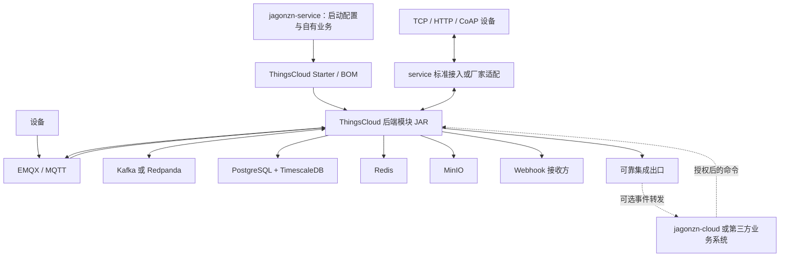

# jagonzn-service 后端复用与独立部署架构方案

> 知识库定位：记录 jagonzn-service 的内核复用、数据库兼容与独立部署方案；旧无限额度章节的现行取代决定见 [JADR-0005](adr/0005-signed-self-hosted-entitlement.md)。
> 原方案创建日期：2026-09-18；职责迁移更新：2026-09-20；隔离验证部署模型与版本对齐更新：2026-09-24。
> 状态：独立部署、数据库与版本原则已明确；平台内核的普通 JAR 本地候选已在 service 装配并验证空库，正式发布与设备业务仍未完成。本文未交付的接口和运行模式仍是建议，当前状态见项目进度。
> 本文承接原 jagonzn-cloud 的设备接入方案；这是职责迁移，不是将 cloud 工程重命名为 service。
> 2026-09-28 更新：负责人明确正式自部署为签名四档权益，ThingsCloud 维护可复用验签/计量内核，jagonzn 负责导入、配置、界面与整体验收。本文中早期“无限额度”“不受档位限制”只描述被取代的历史方案或未发行研发候选，不再是客户发行合同；以 JADR-0005 和平台 ADR0216～0219 为准。

> **负责人已裁定：jagonzn 不得修改 ThingsCloud 的任何代码或数据库表，包括独立部署中的内核副本与迁移。**本文中的正式 Starter、商业解耦、通用事件等尚缺能力是交付需求，不是 jagonzn 改造内核的任务。jagonzn 通过现有受支持接口/配置装配并在自身工程开发厂商适配；不足与建议登记到[独立反馈台账](PLATFORM_CAPABILITY_FEEDBACK.md)，由 ThingsCloud 自行评审。
> 项目分工和集成合同以 [双项目架构主文档](jagonzn-system-architecture.md) 为准。

## 1. 目标与结论

jagonzn-service 是基于 ThingsCloud 后端内核构建的独立 Spring Boot 应用，负责多协议设备接入、技术数据处理、规则、告警、命令和对外集成。项目复用 ThingsCloud 已实现的后端能力、数据库结构和中间件集成，不复制维护另一套核心业务代码。jagonzn-cloud 已开始独立[私有事件 Inbox](adr/0009-cloud-private-event-inbox.md)，人员开锁授权、允许时段和定制 SaaS 业务仍待开发。

service 现另有默认关闭的[单项目签名事件发送适配](adr/0010-service-cloud-signed-event-forwarder.md)，读取平台可信内部源并用受信 HTTPS 指向 cloud Inbox。其本机聚焦验证不等于真实 Kafka 双库、断线恢复或多项目交付；这些仍归专项验收门禁。

推荐采用以下交付方式：

- ThingsCloud 发布可复用的普通业务运行时 JAR；BOM/Starter 可作为后续版本管理与体验增强，当前不作为本地候选的已交付事实。
- jagonzn-service 引入这些二进制依赖，负责应用启动、环境配置、厂家协议适配和集成扩展。
- 内部保留租户、项目与权限模型，默认初始化一个 jagonzn 租户。
- 对客户分发时使用 ThingsCloud 签名的独立四档权益，保留真实用量并由平台内核在全部入口计量和限制；本机有限 `NONCOMMERCIAL` 配置只供未发行研发候选。
- EMQX、Kafka 或 Redpanda、PostgreSQL、TimescaleDB、Redis、MinIO 作为外部基础设施部署。

当前平台已建立普通运行时 JAR，本地候选可装配全量模块并完成 jagonzn 命名迁移及升级测试；商业策略、不可变制品、真实设备与外部资源仍待验证。不能仅依赖原 bootstrap 可执行 JAR 就获得本文完整效果。

service 应在 ThingsCloud 应用和 jagonzn-cloud 均未部署时独立完成设备接入与本地处理。对外转发是独立集成能力，不能将 cloud 可用性变成协议确认或本地存储的前提。

## 2. 需求范围

### 2.1 保留的能力

| 分类 | 目标能力 |
| --- | --- |
| 设备接入 | MQTT／EMQX、标准 HTTP／TCP／CoAP、设备凭据、连接与心跳、消息接收、命令下发；厂家私有协议单独适配 |
| 消息系统 | Kafka 协议集成，部署选择 Kafka 或 Redpanda，并验证兼容性 |
| 后台处理 | Worker、任务调度、重试、幂等、故障恢复 |
| 一致性与集成 | ThingsCloud 已有公共集成及 Webhook 本地交付证据；jagonzn 待完成装配、厂家事件输入及必要的新增输出来源。见[公共集成回执](../../docs/delivery/audits/S14-R8f-1-public-integration-evidence.md) |
| 数据存储 | PostgreSQL、TimescaleDB、Redis，沿用 ThingsCloud 数据模型 |
| 对象存储 | MinIO 集成及已有对象存储能力 |
| 安全与归属 | 租户、项目、身份认证、权限、数据隔离与 RLS |
| 业务能力 | 已实现的设备管理、遥测、规则、告警、任务及其他后端能力 |
| 使用量统计 | 设备存量、每日上下行消息、其他已实现的计量指标 |

“继承全部后端能力”指复用已交付的能力，不代表自动实现规划中的功能。具体功能是否启用，由装配和运行配置决定。

截至 2026-09-24，标准 HTTP／TCP／CoAP 已有属性、命令及回复实现；TCP 使用 TLS 和固定 TC 帧，不支持任意厂家帧。新协议事件上报及 MQTT 通用事件标准化仍存在缺口，逐次开锁记录和设备自报报警需补齐事件管道。技术规则根据已有属性触发告警，与设备主动上传一条报警事件不是同一能力。TCP 多实例下行 D-190 已按方案 A 开发、验证并关闭；这不代表事件上报、用户自定义 codec 或厂家私有 TCP 协议适配已交付。后续多厂商协议扩展方向及烟感现状见[调研记录](protocol-extensibility-and-smoke-adapter-research.md)。

### 2.2 暂不需要的部分

- 不部署 things-cloud-console、things-cloud-platform、things-cloud-webapp。
- 暂不开发 jagonzn-service 前端。
- jagonzn-cloud 已有私有事件接收端，但尚无人员开锁业务或 UI；service 的建设不等待 cloud。
- 暂不开发 Android、iOS、微信小程序等客户端。
- 不在 jagonzn 内复制 ThingsCloud 的 SaaS 订单、支付、退款或资源包系统；自部署申请、签发、续期和有效期由独立签名权益合同处理。
- 不以本地环境变量赋予无限设备或消息用量；正式发行须按已批准的四档修订、部署/租户身份和签名额度拒绝超额。

不开发前端不等于删除管理 API。创建设备、维护物模型、配置 Webhook、查询遥测、下发命令等后端入口仍然需要身份认证与权限控制。

## 3. 应用与租户模型

### 3.1 推荐独立应用复用内核

| 方案 | 含义 | 适用性 |
| --- | --- | --- |
| 共享平台租户 | jagonzn-service 通过 API 使用正在运行的 ThingsCloud 平台 | 适用于集中托管，核心能力运行在平台侧 |
| 独立应用复用内核 | jagonzn-service 引入 ThingsCloud JAR，自行部署运行 | 推荐，符合通过 JAR 获得后端能力的需求 |

jagonzn 是当前 ThingsCloud 项目中的一个租户。jagonzn-service 是该租户的独立验证部署，不依附于 ThingsCloud 应用运行；它另行使用 `jagonzn` 数据库，与 ThingsCloud 原数据库完全隔离，并使用与复用内核版本一致的表结构和迁移。ThingsCloud 版本是源头，service 及其依赖版本向该版本对齐，不得为适配 service 而改变 ThingsCloud 版本。

验证实例内的设备接入结果留在 `jagonzn` 数据库，不实时转发回 ThingsCloud 原数据库。验证发现的平台不足和公共能力建议登记反馈，由 ThingsCloud 自行评审是否修改；jagonzn 不直接修改或回沉公共代码。厂家帧格式、厂商身份映射、命令编码等专属逻辑保留在自身适配器中。实施模型见[隔离验证部署、租户试点与平台合同演进](tenant-validation-and-contract-evolution.md)。

未来 cloud 的 SaaS 客户与 service 内核租户／项目应通过明确映射关联，不能默认同名或同 ID 即代表同一权限范围。多个私有部署还需稳定的 sourceDeploymentId；完整隔离与数据权威规则见主文档。

### 3.2 保留租户和项目结构

- 初始化固定的 jagonzn 租户，并按需要创建一个或多个项目。
- 保留 tenant_id、project_id、设备归属与租户上下文。
- 保留设备认证、项目授权、数据库 RLS 和后台任务的可信作用域。
- 租户上下文由已认证身份、设备归属或受信后台任务建立，不能直接信任客户端传入的租户 ID。
- 单租户模式不意味着使用超级管理员数据库连接绕过数据隔离。

该方式既保持现有数据结构兼容，也保留未来扩展多项目或多租户的可能性。

## 4. 目标运行架构

图中的 Starter 和 BOM 是最初的交付建议。平台当前按[ADR0214](../../docs/adr/0214-official-runtime-reuse-entry.md)采用等效的普通运行时 JAR 本地候选；正式发布与完整接收仍按[实施计划](../../docs/reuse-entry/THINGS_CLOUD_REUSE_ENTRY_PLAN.md)验证。具体消息处理顺序应复用已验证的现有链路，不因打包方式变化而重新定义消息接受、事务提交或确认语义。

JAR 包含业务代码和中间件集成代码，不包含可替代外部服务的 EMQX、Kafka、数据库或 MinIO 服务端。

Worker 属于运行职责，JAR 属于代码交付边界。库化不要求把接入、管理 API、所有消费者与后台任务合并为一个进程。后续应提供明确的运行角色配置，使不同实例只启动其负责的职责，并验证领取、租约、消费者组和幂等机制。

原生 TCP 不通过 EMQX 接入。首期应核对全部 Bean 与基础设施依赖后再决定组件裁剪；同一地址上部署原生 TCP 和 EMQX TLS 时要避开默认 8883 端口冲突。TCP 多实例下行 D-190 已开发、验证并关闭；jagonzn-service 集成时仍须按已关闭合同验收部署配置，不把该能力误写成任意厂家协议或自定义 codec 支持。

## 5. JAR 交付与模块边界

本节是 jagonzn 对已有交付物的核对清单，以及提交 ThingsCloud 的交付能力建议。若现有内核没有正式装配入口，登记 JPF-001；jagonzn 不负责修改平台模块、增加公共 Starter 或改变其打包方式。

### 5.1 交付组成

建议交付以下内容，命名仅为方案示例：

| 交付物 | 职责 |
| --- | --- |
| ThingsCloud 业务模块普通 JAR | 设备、遥测、规则、任务、权限、基础设施等实现 |
| things-cloud-bom | 统一内核模块与兼容依赖版本 |
| things-cloud-spring-boot-starter | 汇总依赖并提供明确的自动装配入口 |
| 自动配置组件 | 控制 API、安全配置、消费者、Worker、数据库访问等装配 |
| 数据库迁移资源 | 与内核版本匹配的 SQL、函数、权限及迁移清单 |
| 部署配置与接口文档 | 中间件初始化、连接配置、公开扩展接口与升级说明 |

外部只需声明少量 Maven 依赖，内部仍可由多个 JAR 组成。不必为了“引入一个依赖”而合并成一个难以维护的大 JAR。

### 5.2 不直接依赖 bootstrap 可执行 JAR

当前 things-cloud-bootstrap 负责完整应用启动和可执行 JAR 打包。业务模块应保持普通 JAR 布局，供 jagonzn-service 正常编译和加载。

jagonzn-service 保有自己的启动类，不需要继承 ThingsCloud 启动类，也不必使用 ThingsCloud 聚合 POM 作为 Maven parent。依赖管理、应用启动和业务复用是不同职责。

jagonzn-cloud 未来通过 API 和事件集成 service，不直接依赖 service 可执行 JAR 或访问其数据库。必要时提供纯合同模型／SDK，避免把两套运行时装配耦合起来。

### 5.3 自动装配要求

原 ThingsCloud 启动类依靠 com.things.cloud 包下的组件扫描。平台当前运行时 JAR 提供自己的自动配置并持有同一全量扫描范围；另一个包名下的应用只显式启用该入口，不自行扫描内核包。首版仅支持全量装配，独立 API/消费者/Worker 角色裁剪仍待后续合同与验证。

应提供正式自动配置，明确控制：

- 启用哪些业务能力与 HTTP 接口。
- 哪些实例启动 Kafka 消费者与后台 Worker。
- 如何注册安全配置与租户上下文。
- 如何加载数据库迁移和默认配置。
- 如何替换商业权限与额度策略。

不应以全包扫描作为长期产品化接口，否则可能一并启动商业 Controller、订阅 Worker 或不需要的客户端功能。

Spring Boot 支持通过发布 JAR 中的 `META-INF/spring/org.springframework.boot.autoconfigure.AutoConfiguration.imports` 注册自动配置，参见 [官方自动配置文档](https://docs.spring.io/spring-boot/reference/features/developing-auto-configuration.html)。

## 6. 签名权益、计量与系统保护

[JADR-0005](adr/0005-signed-self-hosted-entitlement.md)已取代早期无限额度目标。jagonzn 只装配 ThingsCloud 受支持的签名验签/计量组件，并负责本地申请、授权导入和状态界面；平台内部业务、协议和 Worker 入口由 ThingsCloud 内核负责强制。缺少内核入口时登记 JPF-003，不在 jagonzn 覆写内部类或放宽鉴权。当前有限 `NONCOMMERCIAL` 仍只是本机研发候选，不能面向客户发行。

### 6.1 三种职责分离

| 职责 | jagonzn-service 行为 |
| --- | --- |
| 功能权限 | 签名修订允许、平台已交付且当前用户/设备获授权三者取交集 |
| 商业额度准入 | 按单部署、单计费租户的签名四档共享额度及实例安全上限取更严者 |
| 使用量计量 | 保留真实统计、查询、监控和审计 |

例如，同一租户跨项目的设备与消息用量汇入一个共享池；超过已签名设备或 UTC 日消息上限时，在规定的可靠受理点拒绝，并保留已存事实。重复消息、命令重试和设备 ACK 不产生新的逻辑消息额度。

### 6.2 独立运行策略

ThingsCloud 原 SaaS 继续从其订阅与目录解析权益；正式 jagonzn 自部署则通过受信公钥、部署/租户绑定、已批准产品修订和本地原子导入取得平台运行时有效权益。jagonzn 不伪造 SaaS 订阅、不硬编码某个套餐 ID，也不返回“无限”策略。联网与纯离线都导入同一种签名授权；没有有效授权不能回退为 FREE 或本机手填容量。策略切换仍保留鉴权、归属校验和计量，并验证原 SaaS 不受影响。

### 6.3 明确拒绝和缺失语义

当前代码的无限语义并不统一：

- EffectiveQuotaPolicy 的部分字段支持 null 表示不限。
- QuotaMetricUsage 的 limit 支持 null 表示未设上限，零表示禁止继续使用。
- PlanQuotaTemplate 的多个维度使用正数 long，不能直接套用 null 或负数。
- planQuota 为 null 表示没有绑定可售套餐模板，不能解释为全功能无限制。

这些是旧实现的不同数据形状，不能被 jagonzn 解释为正式自部署权益。已批准修订必须完整给出代码、单位和额度；FREE 外部席位 0 是明确拒绝，其他必填维度缺失/未知不表示无限。平台在 Java、SQL、缓存、协议准入、后台任务及实际物理发送前强制同一签名来源。当前[四档待审稿](../../docs/reuse-entry/THINGS_CLOUD_SELF_HOSTED_REVISION_REVIEW_DRAFT.md)尚未获批准。

### 6.4 保留系统保护

套餐允许也不代表无限物理资源。以下保护应保留并按部署容量配置：

- 连接池、线程池、消费者并发和有界队列。
- 请求与消息大小、批次大小、脚本超时及内存边界。
- 重试退避、熔断、背压和存储容量告警。
- 身份认证、凭据校验、回调认证与权限边界。

这些安全限制与套餐额度取更严者。历史查询窗口限制可见范围，不据此删除数据；授权到期时的保留和满盘拒绝另按平台 ADR0217 及后续动态验收执行。

### 6.5 计量口径

沿用既有可审计计量事实，避免每条消息同步争抢同一条租户计数记录。保留幂等合并与必要的对账机制。

目前日计量采用 UTC 窗口。面向业务展示时应标明时区；如未来需要按中国自然日统计，应单独定义展示或聚合口径，不能悄悄改变原有计数语义。

## 7. 商业逻辑耦合与评审建议

当前商业逻辑已经进入核心业务调用链，不能仅关闭订阅 Worker：

| 当前位置 | 已有耦合 | 后续处理方向 |
| --- | --- | --- |
| TenantSubscriptionProvisioning | 新租户创建 FREE 订阅并绑定策略 | 自部署只接收已签名权益，租户初始化不能凭 SaaS FREE 自动授权 |
| SubscriptionExpansionGuard | 订阅宽限状态影响扩大类操作 | 自部署按自己的签名期限、15 天宽限和仅采集状态判断；原 SaaS 不改 |
| ProjectQuotaService 等入口 | 设备等操作读取配额并参与订阅判断 | 保留确权与计量，权益来源改为平台验签内核，不由 jagonzn 手填 |
| SubscriptionLifecycleWorker | 当前默认开启 | 自部署按独立签名期限与续费合同运行，不复用 SaaS 14 天 Worker |
| PostgreSQL 配额相关函数 | 数据库参与权威额度计算 | 同步核对数据库侧语义，避免只改 Java 或只挡 HTTP |

表中处理方向是提交 ThingsCloud 的候选建议，不是 jagonzn 实施任务。是否解耦、接口和装配边界如何设计，由 ThingsCloud 评审决定。

任何商业解耦都应保证原 ThingsCloud 平台的套餐、订阅与配额行为继续正常。

## 8. 数据库与基础设施

### 8.1 保持数据库结构

第一阶段按负责人要求使用与所复用 ThingsCloud 版本一致的表结构、索引、RLS、函数、权限模型及迁移历史。旧草案中“新增 jagonzn 业务通过独立新增表扩展”不能作为本轮建表依据；独立数据库不自动授予修改表结构的权限。

数据库名称和隔离方向已明确：单独创建 `jagonzn` 数据库，与 ThingsCloud 原库分开；是否共享物理 PostgreSQL 集群仍取决于部署条件，数据权限及资源边界必须明确。

cloud 后续的 SaaS 业务数据库另属其自身业务范围，当前不实施。service 的厂家事件或交付事实若无法由现有支持入口承载，应登记平台不足；jagonzn 不新增或修改 ThingsCloud 表、索引、函数、权限模型及迁移，也不通过扩展 schema 绕过同构约束。ThingsCloud 已按负责人最新命名要求，自行从同版本 SQL 生成仅映射数据库角色标识的 jagonzn 迁移资源；表结构保持同构，生成物有独立 checksum，详见[ADR0214](../../docs/adr/0214-official-runtime-reuse-entry.md)。

### 8.2 商业表与商业流程分开处理

在“数据库结构同源”的约束下，SaaS 商业表可以继续存在，但 jagonzn 不从本地 SaaS 订单取得自部署额度；有效期和续费必须取自发行方签名授权。平台若新增可复用的自部署迁移，由 ThingsCloud 发布并按同版本原样进入 jagonzn。

不应为删除商业表而修改历史迁移。若签名权益接线需要调整数据库函数，登记反馈并等待 ThingsCloud 自行评审；jagonzn 不实施平台函数或迁移变更。

当前迁移资源按模块存放，存在跨模块和全局版本顺序约束。因此不能移除某个功能 JAR 后默认其迁移也可以删除。应单独定义完整、可升级的迁移资源交付边界。

### 8.3 部署资源隔离

即使复用同一物理基础设施，也应明确数据库、Redis key 前缀、消息 Topic 与消费者组、MinIO bucket 或对象前缀、EMQX 回调目标与凭据边界，避免 jagonzn-service 与原平台相互消费、覆盖或误投数据。

## 9. 不交付源码的边界

可以通过私有 Maven 仓库交付编译后的 JAR、POM、文档和迁移资源，不提供源码仓库，也不发布 sources.jar。接入方通过公开接口扩展，无需拿到内核源码工程。

但 JAR 含有字节码，可以被反编译；二进制交付不能保证实现不可被还原。SQL 迁移资源也通常是可读取的。

| 目标 | 合适方式 |
| --- | --- |
| 不交付源码工程，允许自行部署和运行 | 二进制 JAR 交付 |
| 不让接入方持有核心实现 | 核心部署在提供方服务端，通过 API 提供能力 |

本方案采用前者。公开 API、版本兼容说明和升级指南应随二进制版本交付。

## 10. 当前项目基线

以下是 2026-09-24 的版本基线；当前进度与验证证据统一见[项目进度](PROJECT_PROGRESS.md)。

| 项目 | Java 配置 | Spring Boot | Maven 坐标 |
| --- | --- | --- | --- |
| things-cloud | 21 | 4.1.0 | com.things.cloud:things-cloud |
| jagonzn-service | 21 | 4.1.0 | com.jagonzn.service:jagonzn-service |
| jagonzn-cloud | 21 | 4.1.0 | com.jagonzn.cloud:jagonzn-cloud |

jagonzn-service 已引入 ThingsCloud 运行时普通 JAR 本地候选，jagonzn-cloud 仍是基础 Spring Boot 项目。三个项目均使用 Java 21 和 Spring Boot 4.1.0；service 的 POM 已按 ThingsCloud 版本对齐并通过本地构建与独立空库测试。这不代表正式不可变制品交付或设备业务集成已完成。

POM 中的 `<modelVersion>4.0.0</modelVersion>` 是 Maven 模型版本，不是 Spring Boot 版本。Spring Boot 基线以 `spring-boot-starter-parent` 的版本为准。后续 jagonzn 跟随 ThingsCloud 已批准基线；本项目不发起用于迁就 jagonzn 的 ThingsCloud 版本升级。

当前 ThingsCloud 已有 shared、support、iam、project、device、telemetry、ingestion、alarm、task、rule、enduser、export、dashboard、ota 等模块。模块存在不代表其全部规划功能已完成，实际复用范围应以代码与验收结果为准。

## 11. 建议实施顺序

1. **冻结复用合同**：确定公开业务接口、运行角色、功能清单、签名权益装配和数据库兼容边界。
2. **核对库交付**：获取已有普通模块 JAR 和装配/迁移资源；缺少交付能力登记 JPF-001，不改平台打包代码。
3. **核对签名权益**：本机有限非商业候选继续独立验收；正式发行须等待已批准四档修订、平台验签/计量内核与受控签发，需要内核改造则登记 JPF-003，不自行复制判定代码。
4. **建立隔离验证部署**：在统一内核/数据库迁移版本基线上装配 service，使用独立运行实例和数据库，不连接或写入其他 ThingsCloud 部署的数据。
5. **按 jagonzn 租户开展设备试点**：先冻结身份、属性、事件、命令、设备结果和可靠性合同，再用一款真实设备端到端验证；后续用其他设备协议检验公共合同是否成立。
6. **登记不足与改进建议**：把多设备对照证据交给 ThingsCloud 自行评审，厂家私有解析和映射留在适配器；缺口不视为已获准改造。
7. **形成 jagonzn 交付记录**：固定所用 ThingsCloud 制品和适配器兼容信息，提供运行说明与验证证据；平台正式交付后再跟随复验。

以上是工作内容分解，执行阶段及门禁统一见[项目进度](PROJECT_PROGRESS.md)，早期 P0～P6 的对应关系见主架构 §11。首台设备未裁定；设备事件接入和对外集成分别核对已有能力与新增范围。ThingsCloud 的进度和门禁仍以其开发进度总览为准；cloud 的 SaaS 业务无当前排期。

本顺序是后续建议，不表示已授权或已经开展代码改造。

## 12. 后续验收标准

- 不依赖三个前端项目或移动端即可启动并完成后端设备操作。
- ThingsCloud 应用与 jagonzn-cloud 均未运行时，service 仍可认证设备、记录数据、处理技术告警和执行受控技术命令。
- 不持有 ThingsCloud 源码工程，仅依赖已发布二进制即可构建运行。
- MQTT 认证、ACL、上行、下行与遥测存储通过真实中间件验证。
- Outbox、消费者、Webhook 和 Worker 在重复、失败、重启场景下保持既有一致性与幂等语义。
- 固定自部署发行候选按有效签名档位验证设备和消息额度内、边界和超额拒绝；过期、宽限、仅采集按平台独立合同执行，不把当前本机非商业结果冒充此验收。
- 使用量仍准确记录；套餐允许也不会绕过设备归属、权限和 RLS。
- 自部署签名生命周期与原 SaaS 订阅流程分离；不需要的商业 API 不在独立现场暴露。
- 空库初始化与已有数据库升级均可完成，迁移资源完整且顺序正确。
- 系统保护按容量配置，出现背压时不被误报为套餐不足。
- 原 ThingsCloud 平台商业模式通过对应回归验证。
- 已配置外发目标不可达时本地处理可继续；重启和响应丢失场景可幂等补发，cloud 未开发时用测试接收端验证。
- 开锁记录逐次保存，心跳确认不被误认作事件持久确认；厂家协议与设备能力有真实证据。

## 13. 实施前待确认事项

- 首期需要实际启用哪些规则、告警、任务、OTA、导出等后端能力。
- 接入、管理 API、消费者及 Worker 的进程划分与初始容量。
- 基础设施采用独立部署还是共享集群上的逻辑隔离。
- 私有 Maven 仓库、版本发布方式与允许的公开扩展接口。
- 遥测历史保留、对象生命周期、备份和恢复要求。

这些事项不影响当前架构方向，但应在具体实现前形成明确配置与验收依据。

## 14. 仓库参考位置

以下路径均相对仓库根目录 D:\ThingsCloud，便于后续按最新代码核实：

- `things-cloud/pom.xml`：模块列表与 Java、Spring Boot 基线。
- `things-cloud/things-cloud-bootstrap/pom.xml`：启动模块依赖及可执行 JAR 打包。
- `things-cloud/things-cloud-bootstrap/src/main/resources/application.yml`：基础设施、迁移与后台处理配置。
- `things-cloud/things-cloud-project/src/main/java/com/things/cloud/project/application/EffectiveQuotaPolicy.java`：运行时策略及部分无限字段语义。
- `things-cloud/things-cloud-project/src/main/java/com/things/cloud/project/domain/plan/PlanQuotaTemplate.java`：商业配额模板与正数约束。
- `things-cloud/things-cloud-project/src/main/java/com/things/cloud/project/domain/QuotaMetricUsage.java`：额度与用量表示。
- `things-cloud/things-cloud-project/src/main/java/com/things/cloud/project/application/ProjectQuotaService.java`：设备配额与归属判断入口。
- `things-cloud/things-cloud-project/src/main/java/com/things/cloud/project/application/TenantSubscriptionProvisioning.java`：FREE 订阅初始化。
- `things-cloud/things-cloud-project/src/main/java/com/things/cloud/project/application/SubscriptionExpansionGuard.java`：宽限期扩大操作门禁。
- `things-cloud/things-cloud-project/src/main/java/com/things/cloud/project/application/SubscriptionLifecycleWorker.java`：订阅生命周期任务。
- `docs/adr/0024-tenant-quota-and-overload-boundaries.md`：租户计量、额度与过载保护边界。
- `deploy/docker-compose.yml`：基础设施部署参考。
- `jagonzn/jagonzn-service/pom.xml`：jagonzn-service 当前应用基线。
