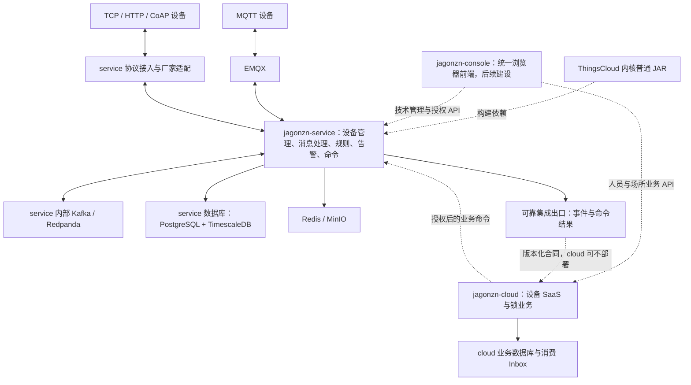

# jagonzn 双项目架构与分阶段实施方案

> 更新日期：2026-09-28。
> 状态：架构规划；service 已有本机复用装配，cloud 已有私有事件 Inbox，人员/场所业务、私网发送和 console 尚未交付；本文不把局部能力当成完整双后端联动。
> 本文是 jagonzn 项目职责的主文档，取代早期由 jagonzn-cloud 承担设备接入的定位。
> 2026-09-28 商用边界更新：[JADR-0005](adr/0005-signed-self-hosted-entitlement.md)取代本文早期“无限额度”产品目标。正式独立部署须有 ThingsCloud 签名四档权益，jagonzn 装配平台验签/计量内核并负责导入、配置和界面；当前本机有限非商业候选不是可发行授权。

已获裁决的长期边界见 [jagonzn ADR 索引](adr/README.md)；本文保留现行架构与实施状态。

> **2026-09-24 负责人裁定：jagonzn 仅使用 ThingsCloud 已有能力，不得修改其任何代码或数据库表。**自身设备适配与验证发现的不足，统一登记到[独立反馈文档](PLATFORM_CAPABILITY_FEEDBACK.md)，由 ThingsCloud 自行评审。本文未交付的公共接口、存储、Starter 和商业解耦均为需求建议，不是 jagonzn 对平台的改造授权。

## 1. 已明确的方向

**jagonzn-service 承载完整的 IoT 接入与运行能力，jagonzn-cloud 承载定制化设备 SaaS 业务；计划新增的 jagonzn-console 统一两个后端的浏览器操作。当前 cloud 仅开始建设私有事件 Inbox，console 尚未交付。** 长期前端边界见 [JADR-0007](adr/0007-unified-console-and-backend-boundary.md)及[私有接收边界](adr/0009-cloud-private-event-inbox.md)。

service 的范围来自原知识库的整套后端复用方案，包含 MQTT／EMQX、HTTP、TCP、CoAP、消息队列、设备管理、遥测、规则、告警、任务、Worker、Webhook、Outbox、存储、安全与计量等能力；各能力按交付状态与需要装配。TCP 智能锁是既有业务场景；首台验证设备尚未裁定，以[项目进度](PROJECT_PROGRESS.md)的试点清单为准。

service 通过 ThingsCloud 普通 JAR 复用内核，在自己的进程和基础设施中运行。**独立部署不依赖 ThingsCloud 应用，也不要求 jagonzn-cloud 已经部署。**代码来源依赖和运行时服务依赖必须区分。

本项目另承担 ThingsCloud 设备接入能力的隔离验证职责：jagonzn 是当前 ThingsCloud 项目中的一个租户；jagonzn-service 使用独立运行实例，并另行创建名为 `jagonzn` 的数据库，与 ThingsCloud 原数据库完全隔离。数据库表结构和迁移与所复用的 ThingsCloud 内核版本保持一致。ThingsCloud 版本是基准，不因 jagonzn-service 而改变；service 及其依赖向所选 ThingsCloud 版本对齐。设备按 jagonzn 租户下可信的项目和设备归属接入。验证设备数据留在 `jagonzn` 数据库，不通过运行时链路回写 ThingsCloud 原数据库；验证发现的不足与公共能力建议登记到独立反馈台账，由 ThingsCloud 自行评审；jagonzn 不修改平台代码或表，厂商专属帧解析和映射留在自身适配器。此为目标架构，当前 jagonzn-service 尚未完成内核集成。

cloud 未来决定谁可以开哪把锁、授权有效时间、撤销权限、客户与场所关系等业务。service 负责把授权后的操作可靠地送到正确设备，并把设备的实际结果返回。设备身份认证与人员开锁授权属于不同职责。

## 2. 本轮核实的现状与证据

### 2.1 两个应用

下表保留 2026-09-24 骨架核查时的状态；cloud 后续 Inbox 实施见[当前进度](PROJECT_PROGRESS.md)，不得把该历史表读成今日状态。

| 项目 | 当前内容 | Spring Boot | Java | 当前缺少 |
| --- | --- | --- | --- | --- |
| jagonzn-service | 启动类、应用名称、上下文测试、Maven Wrapper | 4.1.0 | 21 | ThingsCloud 依赖、接入装配、持久化与转发代码 |
| jagonzn-cloud | 启动类、应用名称、上下文测试、Maven Wrapper、README | 4.1.0 | 21 | SaaS 业务、接口、数据库与消费端实现 |
| ThingsCloud | 多模块后端与协议接入实现 | 4.1.0 | 21 | 面向 jagonzn 的正式库化装配与非商业策略仍需建设 |

Spring Boot 与 Java 版本已对齐：ThingsCloud、jagonzn-service 和 jagonzn-cloud 均为 Spring Boot 4.1.0／Java 21。本轮已将 jagonzn-service POM 对齐至 ThingsCloud 4.1.0，未修改 ThingsCloud POM；构建兼容性仍待后续验证。版本治理原则是 ThingsCloud 为源头，jagonzn 项目适配该基线。Maven `modelVersion=4.0.0` 不是 Spring Boot 版本。

### 2.2 ThingsCloud 接入能力不能仅凭名称判断

以下表格是 2026-09-24 的基线审计快照；后续 service 装配和 cloud Inbox 的实际状态以各自项目 README、[项目进度](PROJECT_PROGRESS.md)及专项回执为准。本轮读取了标准协议合同、接入指南、协议服务端、标准化器与会话注册表。仓库总架构和部分旧说明仍有“AX 未实现”的过时描述；以下以当时实现和专门协议合同为依据，不将旧状态直接复制到新方案。本轮未重跑 ThingsCloud 全量或真实设备测试。

| 能力 | 当前证据与边界 | 对 service 的影响 |
| --- | --- | --- |
| MQTT／EMQX | 有既有设备认证、属性、命令等路径；通用事件上报尚未形成闭环 | 可复用已实现路径，不能把 MQTT 事件 Topic 当成已交付事件服务 |
| 标准 HTTP | 已有 HTTPS 认证、属性上报、命令领取与回复 | 可纳入内核装配，仍需独立部署验收 |
| 标准 TCP | 已有 TLS、固定 TC 帧、认证、分帧、心跳、属性、会话内命令及回复 | 可复用标准协议，不自动兼容厂家私有 TCP 报文 |
| 标准 CoAP | 已有 DTLS 端点、属性、命令领取与回复 | 按设备支持情况启用，不等于支持全部 CoAP 扩展 |
| TCP 多实例 | D-190 已按方案 A 完成开发、验证并关闭；设备线格式按对应 ADR，至少一次投递要求设备去重 | 可按已关闭合同评估多实例 TCP 下行能力；不代表任意厂家协议或自定义 codec 已支持 |
| 设备事件 | 新协议合同排除事件上报；MQTT 标准化器目前拒绝非属性类型，其他专用路径另行处理 | 开锁记录、设备自报报警必须补充可靠事件接入与保存能力 |
| 告警、规则与通知 | 存在对应内核模块；设备主动事件的识别需独立核验 | 不等于任意锁事件已能被识别 |
| 公开集成与 Webhook | 已有公开 REST、应用 MQTT/WS 及七类源的公共 Webhook 本地交付证据，见[公共集成回执](../../docs/delivery/audits/S14-R8f-1-public-integration-evidence.md) | 优先核对现有 integration 能力的装配和兼容；厂家设备主动事件不在该七类源清单内，不能据此认领设备事件接入已完成 |

当前 TCP 服务端使用 JDK SSLServerSocket 和 Java 21 虚拟线程，不应在规划中误写为已采用 Netty。原生 TCP 与 EMQX MQTT 是并行接入通道；TCP 设备不必先经过 EMQX。

## 3. 两个项目的职责矩阵

| 能力或事实 | jagonzn-service | jagonzn-cloud（后续） |
| --- | --- | --- |
| 设备注册、技术标识、凭据、协议绑定 | 权威管理；提供受控管理 API | 维护业务资产映射，通过 API 发起关联操作 |
| MQTT／TCP／HTTP／CoAP 接入 | 负责连接、认证、报文校验与协议适配 | 不直接维护设备连接 |
| 心跳、在线状态、连接会话 | 权威事实；处理断线、代次与重连 | 保存展示投影，显示数据更新时间与来源是否可达 |
| 属性、遥测、设备影子 | 保存技术事实与历史，执行技术校验 | 保存必要的业务投影或通过接口查询 |
| 开锁记录 | 记录设备报告的事实、时间、原因码与原始标识 | 关联人员、门、场所，形成业务审计与报表 |
| 低电量、防拆等技术报警 | 设备报警归一化、技术规则评估与告警生命周期 | 关联客户和责任人，形成业务处置流程 |
| 非授权时段开锁等业务告警 | 提供可信设备事实；不自行维护人员授权规则 | 根据业务授权、时段和组织关系判定 |
| 命令执行 | 受理、验证范围、协议编码、派发、回执、超时与去重 | 业务授权、审批、生成操作意图并呈现结果 |
| 谁能开锁、有效期、撤权 | 执行已授权指令；若未来支持离线策略，仅承载显式下发的执行副本 | 人员开锁权限的权威来源 |
| 规则与任务 | 技术自动化、设备任务及执行设施 | 业务编排、预约与业务决策 |
| Webhook、Outbox、Worker | 内部异步处理及向外可靠交付 | 接收去重、业务处理；后续业务出站也需可靠交付 |
| 租户、项目、安全与计量 | 保留 ThingsCloud 模型和真实用量；正式发行按平台签名四档权益强制 | 未来 SaaS 客户隔离、人员权限与业务审计 |
| 浏览器前端 | 不内嵌独立网页；管理 API 和运维入口仍需有 | 不内嵌独立网页；后续提供业务 API，由 jagonzn-console 统一呈现 |

技术告警的发生、恢复由 service 管理；cloud 的“已读、指派、处理完成”是另一套业务状态。业务人员关闭工单不能直接抹掉设备仍在持续报警的事实。若要从 cloud 确认技术告警，应显式调用 service API 并保留审计。

## 4. 推荐总体结构

图中通道表示职责关系，不要求每个方框都成为独立微服务。首期保持可维护的模块化结构，优先完成 service 独立运行；需要拆分进程时再明确配置与容量依据。

console 是前端工程边界，不是第三套设备或业务数据权威；首期即使 cloud 缺席，service 的受控 API/命令仍能初始化、生成申请、导入授权和恢复。统一页面不意味着共用两后端数据库或直接复用同一令牌，双后端认证与角色映射须在集成前单独冻结，见 [JADR-0007](adr/0007-unified-console-and-backend-boundary.md)。

首版部署形态按 [JADR-0008](adr/0008-two-deployment-network-modes.md)收敛为公网双后端与全内网双后端。前者两后端均可有公网地址，但只开放必要的设备协议和受控 API；后者两后端在无互联网的可互通局域网中运行。两种形态都保留 service/cloud 各自数据库与同一签名权益内核，不能从一个 HTTPS 端口推断全部设备协议已接入。

cloud 不应依赖 service 的可执行 JAR，也不应启动另一份 ThingsCloud 设备消费者、规则引擎或数据库迁移。两项目可共享纯接口模型或轻量 SDK，但运行逻辑通过 API／事件集成，禁止循环 Maven 依赖。

## 5. 上行：从设备报文到 SaaS 业务事实

### 5.1 处理顺序

1. service 接收设备报文，完成协议校验、认证、项目归属、会话有效性与必要保护。
2. 转换为明确类型的属性、设备事件或命令回复；保留协议与厂家原始标识以便追溯。
3. 按内核持久交接合同进入可靠消息处理链路；协议层响应不等待 cloud。
4. service 保存遥测、设备事件或命令结果，必要时运行技术规则和告警评估。
5. 对需要外发的事实产生持久集成事件，由独立 Worker 向已配置接收方交付。
6. cloud 后续先持久接收并去重，再异步更新业务投影、关联人员或触发业务处理。

设备协议确认、service 持久受理、数据库处理完成、cloud 持久接收、cloud 业务处理完成是不同阶段，接口与日志应分别表达。

### 5.2 三类锁数据不能混成一种

- **心跳**：用于连接与活跃状态；默认不要求每个心跳都转发给 cloud，可转发状态变化和约定周期的摘要。
- **属性**：电量、门磁状态等具有当前值和历史采样；可按业务合同选择变化上报或聚合，不能隐式丢弃审计事件。
- **事件**：开锁、异常开门、防拆等逐次发生事实；每次发生独立记录，不能仅覆盖 `lastUnlockTime` 或一个布尔值。

设备自报“开锁成功”只表示设备报告的结果；是否确实门已打开，取决于设备反馈与传感器能力。未上报操作者身份时，cloud 也不能凭设备 ID 推断开锁人员。

### 5.3 公共集成能力与设备事件缺口

ThingsCloud 已有独立于告警通知正文的公开集成域，包含版本化事件、持久交接、Webhook 管理和恢复等能力；范围与资格见[集成实施合同](../../docs/delivery/S14-R8-integration-contract.md)及[公共集成本地证据](../../docs/delivery/audits/S14-R8f-1-public-integration-evidence.md)。jagonzn 应先核对这些能力的复用与装配，不能从“通知正文不适合业务同步”推导出需重新实现整套公共 Webhook。

当前仍需补齐的是烟感报警/恢复、开锁记录等厂家主动事件进入平台的合同与处理链路，以及它们是否需要新增公开事件来源。现有公共事件输出能力不自动提供厂家事件输入接口。下节字段只作为 jagonzn 需求草案；已有公共信封和事件名称以 ThingsCloud 合同为准，具体新增项需差异评审。

首期建议以 HTTPS 事件推送作为跨部署集成方式，适合私有网络向外连接；内部 Kafka 保留，默认不向外部 SaaS 暴露整个内部 Topic 和集群。未来专网高吞吐部署可增加专用消息通道，业务事件合同保持一致。

## 6. 事件合同与可靠交付建议

以下是 jagonzn 扩展需求草案，不是已冻结的第二套公共事件合同。ThingsCloud 已有的事件信封、持久交接与 Webhook API 以[公开集成边界 ADR0168](../../docs/adr/0168-public-integration-boundaries-and-provider-evidence.md)和[集成实施合同](../../docs/delivery/S14-R8-integration-contract.md)为准；尚未实施的是 jagonzn 的内核装配、厂家主动事件接入及经评审确认的扩展差异。

### 6.1 事件信封

| 字段 | 建议语义 |
| --- | --- |
| eventId、eventType、schemaVersion | 单次事实的稳定 ID、事件类型与合同版本；重投不生成新 eventId |
| sourceDeploymentId | 标识逻辑 service 部署，重启不变化；不能使用 Pod 名称替代 |
| tenantId、projectId、deviceId | service 侧技术归属，由可信身份推导 |
| occurredAt、receivedAt、recordedAt | 设备发生、平台接收和记录时刻；保留设备时钟误差诊断 |
| deviceMessageId／vendorRecordId | 原始报文或记录标识；没有可靠标识时说明去重保证的局限 |
| aggregateVersion／sequence | 需要顺序的状态流版本；不承诺所有设备全局有序 |
| correlationId／commandId | 关联操作与命令；自主开锁记录可以没有命令 ID |
| protocol、payload、traceId | 协议来源、版本化业务负载与链路诊断信息 |

现有公共事件名称包括 `device.online`、`device.offline`、`device.property.report`、`alarm.triggered`、`alarm.recovered`、`command.completed` 和 `ota.job.completed`，精确语义见 ADR0168 及各源合同。原草案中的 `device.status.changed`、`device.property.reported` 等名称不作为现有接口使用。厂家主动事件名称、负载和接入方式仍待冻结；是否扩展公共输出应单独评审。

### 6.2 可靠性规则

- 对外采用至少一次交付和接收端幂等，不宣称跨数据库、HTTP、消息队列的天然 exactly-once。[Kafka 官方关于外部系统交付语义的说明](https://kafka.apache.org/40/design/design/)
- 需要外发的数据库事实与集成 Outbox 意图在同一事务写入；若消费内核 Kafka 事件产生出站事实，则在本地事务内去重并写交付意图，提交后才确认消费。两种接入点选择一种权威来源，避免重复生成业务事件。
- 复用现有 Outbox 基础设施前核对顺序、领取、重试和清理合同；新建跨平台交付状态不应擅自改写内核 Outbox 语义。
- cloud 以 `(sourceDeploymentId, eventId)` 持久去重；相同键不同内容拒绝并告警。只有 Inbox 或等价接收事实提交后，才返回双方约定的持久接收成功响应。
- 重投、响应丢失、Worker 重启不得产生重复业务开锁记录。去重保留期必须覆盖最大补发与重放周期，不能无条件照搬内核 7 天幂等保留期。
- 每个接收目标分别保存交付结果、重试次数和错误；故障目标不阻塞其他目标。重试耗尽转待处理／死信，提供重放入口。
- 状态更新拒绝旧版本覆盖新版本；迟到的开锁记录仍追加保存。补发流与实时报警应有公平调度，防止大批历史数据压住新报警。
- 可重建的设备状态支持带版本／游标的快照与增量对账；不可重建的历史事件只能在保留期内补发。新接收方从何时开始消费必须显式配置。
- 转发目的地按项目和数据类型选择；默认不广播全部数据，不外发设备密钥、人员凭据或完整原始报文。
- 合同采用显式版本和向后兼容的新增字段；破坏性变更发布新版本。未知事件版本进入可诊断的隔离队列，不能假装已完成业务处理；service 与 cloud 应允许在约定兼容窗口内独立升级。

### 6.3 cloud 未部署和暂时故障的区别

| 状态 | service 行为 |
| --- | --- |
| 未配置任何转发目标 | 正常接入和本地处理，不为不存在的 cloud 无限生成失败投递任务 |
| 已配置目标暂时不可达 | 持久积压、退避重试、容量告警，恢复后按合同补发 |
| 首次启用目标 | 明确启用游标与历史回放范围，不默认能够恢复所有过去数据 |
| 积压接近容量边界 | 告警并执行明确背压／保留策略，不默默删除未交付的关键事件 |

签名套餐额度不等于可用离线缓存容量。设备数、平均速率、事件大小、可容忍离线时长和副本开销决定积压容量；这些参数需在部署前测算。

### 6.4 跨应用身份与接收安全

复用公共 Webhook 时，认证、签名和出站安全规则首先遵守现有集成合同；下述内容是未来跨部署需求的评审清单，不授权改写现有签名格式或增加必填字段。确需新增通道时，服务间采用 HTTPS 和受限服务身份，mTLS 或其他签名方案须另行冻结。鉴权应绑定发送部署、接收目标、项目范围与允许操作，不能仅凭 payload 内的 tenantId 或 sourceDeploymentId 授权。

如果采用请求签名，应覆盖请求目标、时间戳、随机数与正文摘要，明确时间窗口、防重放和密钥轮换。投递重试重新生成认证信息，但业务 eventId／命令幂等键保持不变。签名防重放不替代业务去重。

转发地址只能由授权管理入口配置；复用既有 Webhook 出站地址校验，并针对私网目标配置显式可达范围，避免任意 URL 造成越权访问。日志和死信诊断默认脱敏；原始报文按最小必要范围保存，不能复制到所有接收方。

## 7. 下行：业务授权与设备执行

未来典型链路为：cloud 确认操作者身份与开锁权限 → 生成授权操作 → service 受理技术命令 → 路由到设备 → 设备执行回复 → service 记录结果 → cloud 更新业务操作状态。

cloud 管理人员身份、锁与场所关系、允许时段、时区、审批和撤权。service 校验调用方是否有权操作对应部署、项目和设备，校验命令类型、有效期、参数、重复请求和设备状态；不接受匿名或任意来源的“开锁”调用。

首期尚无人员业务授权时，技术命令只向明确授权的设备运维身份开放并记录审计，不能将该调试入口直接作为未来 SaaS 用户开锁接口。

当前本机实验的收敛路径见 [JADR-0013](adr/0013-technical-command-lab-and-business-unlock-boundary.md)：先从 service 受控运维命令取得真实技术终态，并核对 `command.completed` 进入 cloud 独立 Inbox；cloud 尚不发起人员开锁业务。现有公开 API Key 命令请求不带业务操作失效时间，不能用浏览器或 cloud 的发送前检查代替 service 派发/重试时的失效拒绝。

建议合同包含：业务操作 ID、目标部署／项目／设备、命令类型与参数、幂等键、请求摘要、签发／失效时间、关联审计信息，必要时携带授权决策版本。service 原子保存幂等映射和技术命令，重复请求返回同一受理结果；同键不同内容拒绝。

必须区分：业务已授权、service 已受理、已派发、设备 ACK、设备报告成功、失败、超时以及结果未知。上述是跨项目语义，不要求直接新增同名内核状态枚举。超时或 socket 写成功都不能直接标为“锁已打开”。

对物理开锁操作，设备若不支持命令 ID 去重或结果查询，不能承诺一次且仅一次执行。默认不对失效的开锁操作做恢复后补执行；未知结果不能无条件自动重发。人员权限下发等可幂等配置命令，与瞬时开锁命令使用不同的重试与过期策略。

离线门禁授权属于未来独立功能：由 cloud 管理权威规则，设备或明确的本地执行组件使用版本化、有限有效期的授权副本，并设计撤权、时钟与断网规则。**service 独立接入不等于已经具备离线人员授权能力。**

## 8. 智能锁 TCP 场景的实现边界

### 8.1 标准协议与厂家协议分开判断

ThingsCloud 标准 TCP/TLS 使用固定 TC 帧、JSON 载荷和 ACCESS_TOKEN 身份。当前明确支持属性与命令回复，但不支持任意厂商私有帧。

| 设备情况 | 建议路径 |
| --- | --- |
| 固件可实现标准 TC 协议 | 复用认证、连接、属性、命令等路径；逐次开锁和报警事件仍需扩展事件合同 |
| 固件固定为厂家私有 TCP | 增加厂家协议适配，复用核心认证／归属／会话／持久交接端口；不能把原始私有帧送入标准 TC 解码器 |
| 设备仅能明文 TCP 或不支持现有认证 | 先评估受控现场网关、安全隧道及信任转换，不直接关闭标准监听器的安全要求 |

2026-09-24 已明确新增能力方向：后续设备厂商的 TCP 协议会持续增加，ThingsCloud 应逐步形成可扩展的数据流和协议适配能力，并按版本与真实设备证据控制兼容范围。已掌握的设备样例包括 4G 烟感私有协议和 JT808 风格的简工智能锁协议；智能锁的标准版本符合性尚未核实。此方向尚未决定编解码器运行位置、用户自定义方式、事件合同或插件 API；具体评估见[多协议接入与设备适配调研记录](protocol-extensibility-and-smoke-adapter-research.md)，实现前须冻结这些接口。

通用协议能力适合沉淀在 ThingsCloud 内核；具体锁型号的帧解析、原因码映射和命令编码可放在 service 的适配模块。不要把“某个用户今天能否开门”的 SaaS 规则写入编解码器。

### 8.2 隔离验证部署与问题反馈

jagonzn-service 是 ThingsCloud 共用接入合同的隔离验证部署，不是把设备数据转发到另一套 ThingsCloud 的运行时协议网关。jagonzn 是当前 ThingsCloud 项目中的一个租户；验证部署另行创建 `jagonzn` 数据库，与 ThingsCloud 原数据库完全隔离。库表和迁移匹配所复用的 ThingsCloud 内核版本，ThingsCloud 版本保持不变，由 service 侧对齐。设备在该库中按 jagonzn 租户下的项目和设备归属隔离。

候选验证链路为：厂家设备 → 厂商适配器 → 候选业务接入合同（身份、属性、事件、命令、设备结果及可靠性语义）→ jagonzn-service 所装配的 ThingsCloud 内核 → 验证实例数据库。用真实设备或可复现的协议样本验证成功、拒绝、重复、断线、重连、迟到回复及恢复路径。jagonzn 下不同设备协议的证据用于判断哪些字段和语义具有共同性；稳定共性的部分形成建议，由 ThingsCloud 自行评审是否纳入公共能力。

公共能力演进由 ThingsCloud 根据 jagonzn 反馈独立评审和实施；jagonzn 不直接回沉合同或代码。适配器留在 jagonzn 自身范围，通过已有接口使用内核。ThingsCloud 如正式交付新基线，jagonzn 再记录版本、制品、适配兼容与原样迁移并复验；表结构相同本身不能证明行为合同兼容。

详细术语、数据边界、验证证据和仍待冻结的集成决策见[隔离验证部署、租户试点与平台合同演进](tenant-validation-and-contract-evolution.md)。

### 8.3 需要厂家提供或实测确认的内容

- 帧头、长度、字节序、校验、加密、认证、协议版本及真实报文样本。
- 心跳周期、离线重连、记录缓存、上传重试与确认机制。
- 开锁记录和报警是独立消息还是属性变化，是否带记录流水号、设备时间、操作者槽位或原因码。
- 命令是否支持稳定 ID 去重、业务 ACK、最终结果及查询；断线后是否自动重执行。
- 凭据配置、撤销、设备复位与重新绑定如何处理。

不假定锁支持这些能力。没有可靠记录号时，用时间或 payload 哈希去重可能把两次真实开锁误合并，需要与厂家确定可接受的保证范围。

### 8.4 首期必须补齐的事件与确认能力

首台设备闭环需要逐次设备事件模型、持久保存、幂等与查询；当前不足登记为 JPF-002，交由 ThingsCloud 评审。jagonzn 不改平台代码或表结构，也不把开锁记录压成属性来认领闭环；相关项保持受阻。既有公共集成出口优先复用，厂家事件是否新增公共输出不作为单设备本地闭环的默认前置任务。

现有标准 TCP 已提供 `ACCEPTED(0x13)`：属性在可靠交接后应答，命令回复在应用事务完成后应答；参见[标准协议接入合同](../../docs/device-integration/STANDARD_PROTOCOL_ACCESS.md)与[ADR0141](../../docs/adr/0141-tcp-explicit-acceptance.md)。该确认不代表设备执行成功，也不代表厂家开锁/报警事件已经受支持。厂家逐记录确认、查询及重放语义仍需按其协议冻结；不能以心跳 ACK 代替事件持久受理。

## 9. 数据、租户与数据库边界

service 沿用原方案的 PostgreSQL／TimescaleDB、Redis、MinIO 和 ThingsCloud 内核数据库结构；cloud 使用自己的业务数据库。可以共享物理集群，但应使用独立数据库、角色、迁移和访问权限，禁止直接查询或修改对方的业务表。

| 数据 | 权威方 | 另一方的使用方式 |
| --- | --- | --- |
| 设备凭据、会话、技术配置、遥测与设备事件 | service | API 查询或最小必要投影，不复制设备密钥 |
| 命令执行过程和设备回复 | service | cloud 关联业务操作并接收结果 |
| 人员、组织、门／场所、授权与业务工单 | cloud | service 只取得操作所需的可信授权上下文 |
| 技术报警与恢复 | service | cloud 消费事实，维护独立业务处置状态 |

首版正式自部署为一个部署、一个计费业务租户及签名四档额度；旧“一个 jagonzn 租户、无限商业额度”只保留历史方案范围。未来 SaaS 客户 tenant 与内核 tenant／project 不是天然同一个概念。映射应至少绑定 `sourceDeploymentId + tenantId + projectId`，并在服务端维护到 SaaS 客户／站点的明确授权关系；不能把设备序列号当成全局唯一业务主键。

未来共享 service 面向多客户时，需要明确是按内核租户还是项目隔离，并以测试证明跨客户隔离。私有部署复用相同数据库模板时，部署标识与数据恢复／克隆规则也要明确，避免重复身份使历史事件误归属。

原 SaaS 商业表可保留以维持迁移兼容；service 的自部署到期、续费和套餐额度以发行方签名权益为准，不借旧 SaaS 订阅状态。鉴权、计量、连接预算和存储保护仍与套餐取更严者；商业额度与人员开锁授权始终是不同概念。详见 [service 内核复用方案](jagonzn-service-backend-architecture.md)。

## 10. 独立部署与私有部署预留

### 10.1 当前必须可实现的运行方式

**设备 + jagonzn-service + 所需中间件**形成完整接入和本地处理闭环；ThingsCloud 平台、jagonzn-cloud 和 jagonzn-console 均非设备运行前置。service 提供认证的设备初始化／配置／查询及授权恢复接口和运维工具，不依赖前端控制台完成必要初始化。部署 console 时它统一呈现 service 的技术操作；后续 cloud 交付后再加入业务操作。

JAR 不会自动部署 EMQX、Kafka／Redpanda、PostgreSQL、Redis 或 MinIO。首期按内核实际依赖闭包部署，不能因为只验证 TCP 就假定 EMQX 等组件已可安全移除；后续按协议裁剪需通过缺依赖启动和真实链路验证。

原生 TCP 与 EMQX TLS 的默认配置都可能使用 8883；同一地址部署时需分配不同端口或入口，不能直接复用示例导致监听冲突。

### 10.2 首版双后端部署形态

| 形态 | 说明 |
| --- | --- |
| 公网双后端 | service 与 cloud 均可在有公网地址的主机运行；按需开放设备协议和受控 HTTPS API，console 访问两后端；联网授权码由 service 出站兑换签名文件 |
| 全内网双后端 | service、cloud 和 console 在可互通的内网且无互联网；使用离线申请和签名授权文件，设备及管理入口仍按协议验证 TLS/DTLS，数据库各自隔离 |

本轮不决定具体服务器地址和证书配置。公网模式验证两后端可通过受控 HTTPS/事件合同互通，以及 service 对发行方的出站连接；全内网模式验证局域网内两后端互通和离线授权文件导入。两种形态都不公开数据库或 Kafka 端口，继续沿用命令幂等、有效期、回执及事件重放合同。若全内网两后端彼此物理隔绝，service 可独立完成设备技术链，但 cloud 业务联动不在本形态内。目标地址、协议和端口以部署合同及实测为准，见 [JADR-0008](adr/0008-two-deployment-network-modes.md)。

### 10.3 扩容边界

D-190 已按方案 A 完成并关闭，复用范围是 TCP 专用广播、会话归属/代次核验及待发恢复。设计见[ADR0143](../../docs/adr/0143-tcp-broadcast-routing-and-pending-recovery.md)，最终状态以[同候选资格回执](../../docs/delivery/audits/G3-TCP-D190-2026-09-19-qualification.md)及[ThingsCloud 进度](../../docs/PROGRESS.md)为准；ADR 内“尚未实现”是接受时的历史状态。jagonzn 仍需验证自己的装配和厂商适配器会话行为，单实例试验不能替代该部署的多实例、硬件及容量资格。

## 11. 实施顺序与完成标准

当前阶段、完成判据和未决项统一维护在[jagonzn 项目开发进度总览](PROJECT_PROGRESS.md)。原 P0～P6 为早期架构工作包，按下表对应现行阶段，不再作为另一套执行状态表。

| 早期工作包 | 现行阶段或处置 |
| --- | --- |
| P0 职责与协议确认 | 阶段 0 的内核复用前置；具体厂家协议与身份合同是阶段 2 前置 |
| P1 内核库化、P2 标准接入基线 | 阶段 1：核对并复用已有交付；平台库化改造仅反馈 ThingsCloud，不由 jagonzn 实施 |
| P3 厂家适配与设备事件 | 阶段 2：在已有平台能力内适配首台设备，缺口登记受阻，不改平台 |
| P4 对外可靠集成 | 现有公共集成列入阶段 1 的能力清单；厂家新增事件输出与接收方范围待明确，不自动列为首台本地闭环前置 |
| P5 独立部署验收 | 阶段 3：设备闭环、隔离、恢复及独立部署验收 |
| 新增跨协议对照 | 阶段 4：整理不同协议的证据与改进建议，ThingsCloud 自行评审，jagonzn 不直接回沉代码 |
| P6 未来 cloud | 独立后续业务范围，无当前排期；完成阶段 4 不自动启动 SaaS 开发 |

首期最小闭环是“一种真实设备／协议 → 本地可信事实 → 技术报警或记录 → 可选测试接收端”。完整能力范围不缩减，但不要求同时开发所有型号、所有协议扩展和未来 SaaS。

验收必须涵盖：无 cloud 启动；跨范围访问拒绝；本机有限非商业候选与正式签名四档分开验证，后者覆盖额度内、边界、超额拒绝及真实用量；设备重复上报；断网／重启补发；接收成功响应丢失；晚到状态；未知或过期命令不误执行；数据库迁移与恢复；真实设备断线重连。不得用模拟接收器验证结果冒充 SaaS 已交付或物理锁已正确执行。

## 12. 文档迁移与本轮交付边界

- 原设备接入方案迁移为 [jagonzn-service-backend-architecture.md](jagonzn-service-backend-architecture.md)，保留 JAR、数据库与计量原则；非商业无限目标已由 JADR-0005 取代。
- 原路径 [jagonzn-cloud-backend-architecture.md](jagonzn-cloud-backend-architecture.md) 改为职责变更说明与新文档入口，避免旧链接继续传播错误定位。
- 两个项目的 README 分别说明设备运行底座和未来 SaaS 职责。
- 2026-09-20 职责迁移仅更新文档；2026-09-24 已按负责人要求对齐 service 的 Spring Boot POM。当前实际状态以[项目进度](PROJECT_PROGRESS.md)为准，内核、数据库和设备接入不能凭规划认领为已交付。

## 13. 核查入口

- [jagonzn 项目开发进度总览](PROJECT_PROGRESS.md)：阶段状态与进入/完成判据；不替代 ThingsCloud 进度总览。
- [当前标准协议合同](../../docs/device-integration/STANDARD_PROTOCOL_ACCESS.md)：能力范围、TCP 帧、确认语义与事件排除项；D-190 已关闭，关闭证据见合同关联的 ADR/验收记录。
- [多协议接入与烟感适配调研](protocol-extensibility-and-smoke-adapter-research.md)：厂商协议适配目标与待裁定设计。
- [隔离验证部署与平台合同演进](tenant-validation-and-contract-evolution.md)：jagonzn 验证实例与 ThingsCloud 共用能力的边界。
- [MQTT 接入指南](../../docs/device-integration/DEVICE_INTEGRATION_GUIDE.md)：MQTT 能力边界；其中旧 AX 状态需结合最新协议合同判断。
- [AX 阶段记录](../../docs/progress/AX.md)：阶段交付与验证记录，本轮未重新执行其中测试。
- [标准 TCP 服务端](../../things-cloud/things-cloud-ingestion/src/main/java/com/things/cloud/ingestion/infrastructure/protocol/tcp/DeviceAccessTcpServer.java)。
- [TCP 会话注册表](../../things-cloud/things-cloud-ingestion/src/main/java/com/things/cloud/ingestion/infrastructure/protocol/tcp/DeviceAccessTcpSessionRegistry.java)。
- [新协议上行标准化器](../../things-cloud/things-cloud-ingestion/src/main/java/com/things/cloud/ingestion/application/access/DeviceAccessUplinkNormalizer.java)。
- [MQTT 基础上行标准化器](../../things-cloud/things-cloud-ingestion/src/main/java/com/things/cloud/ingestion/application/RawUplinkMessageNormalizer.java)。
- [公开 JAR 自动配置机制](https://docs.spring.io/spring-boot/reference/features/developing-auto-configuration.html)：用于后续内核装配设计。
