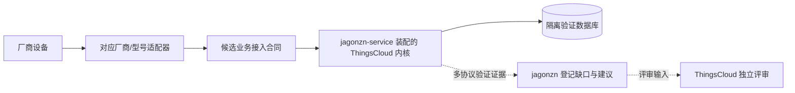

# 隔离验证部署、租户试点与平台合同演进

> 更新日期：2026-09-24
> 状态：目标架构与验证流程说明；jagonzn-service 当前尚未完成 ThingsCloud 内核集成，本文件不表示实现已交付或 ThingsCloud 当前执行轨迹已调整。

## 1. 目的

用 jagonzn-service 作为隔离的设备接入验证部署，为 ThingsCloud 逐步建立可复用、受控、可验证的设备业务接入合同和协议适配扩展边界。烟感、智能锁及后续厂商设备可在验证部署中检验合同是否覆盖真实设备的身份、属性、事件、命令与设备结果闭环。

验证工作的产出是设备适配证据、能力不足记录和改进建议，由 ThingsCloud 项目自行评审是否修改及如何实施；jagonzn 无权修改任何 ThingsCloud 代码或数据库表，也不直接向共用内核回沉代码。验证实例收到的设备数据不实时转发到另一套 ThingsCloud。

**2026-09-24 负责人裁定：jagonzn 是能力使用方、设备适配与验证方、问题反馈方；ThingsCloud 是公共代码、数据库结构、合同和版本的评审及变更责任方。**此边界同样适用于 jagonzn 独立部署中的 ThingsCloud 副本，不能通过复制源码、修改 JAR、数据库函数或迁移绕过。jagonzn 可在自身项目开发适配代码，并通过已有受支持接口与配置使用平台；若需要新增平台能力，登记缺口并停止依赖该能力的实现。

### 为什么使用 ThingsCloud 租户模型和独立数据库

`jagonzn` 是当前 ThingsCloud 项目中的一个租户。以这个租户身份开发设备接入，可以直接验证平台真实使用的租户、项目、设备归属、认证授权、数据权限和设备业务链路，避免另造一套实验专用身份模型，导致设备适配在实验环境可用、进入 ThingsCloud 后却因身份或权限语义不同而返工。

jagonzn-service 独立运行并另建 `jagonzn` 数据库，是为了隔离现有 ThingsCloud 部署的数据与访问凭据，同时仍采用与所复用 ThingsCloud 版本一致的表结构和数据库迁移。这样开发者可以在受控环境中验证同一套内核数据模型和升级路径，不需要直接连接或写入 ThingsCloud 原数据库。运行负载与故障隔离还取决于数据库实例、Kafka/Redis 等中间件的部署、命名空间、权限及资源配置；仅创建另一个数据库不能证明这些隔离已成立。

整体目的可以概括为：**真实租户模型 → 独立同构部署 → 设备适配与闭环验证 → 记录不足和建议 → ThingsCloud 独立评审。**jagonzn-service 当前仍是 Spring Boot 骨架，尚未完成内核依赖和设备接入；上述说明是目标设计，不是已交付状态。

## 2. 术语与部署边界

| 名称 | 本文含义 | 边界 |
| --- | --- | --- |
| ThingsCloud 共用内核 | ThingsCloud 平台中可供装配复用的公共业务能力 | 公共代码、表结构、合同和版本由 ThingsCloud 评审维护；实际发布/库化能力按实施状态核实 |
| jagonzn-service 验证部署 | 独立运行的 jagonzn-service 应用及其基础设施 | 独立进程，另行创建名为 `jagonzn` 的数据库；与 ThingsCloud 原数据库完全隔离，但表结构/迁移按所复用 ThingsCloud 版本对齐 |
| ThingsCloud 租户 | ThingsCloud 数据模型中的 tenant/project/device 归属范围 | jagonzn 是当前 ThingsCloud 项目中的一个租户，其设备在本验证部署中按 jagonzn 的项目与设备归属进行认证和隔离 |
| 厂商适配器 | 某厂商或型号的帧解析、身份映射、字段映射、命令编码及协议确认处理 | 默认保持在独立适配边界；不会因为验证一次就自动成为 ThingsCloud 原生协议 |
| 公共业务接入合同 | 平台与适配器之间对身份、属性、事件、命令、结果及可靠性语义的约定 | jagonzn 使用已有合同，缺失语义形成建议；新增公共合同由 ThingsCloud 决定 |

“jagonzn 是当前 ThingsCloud 项目中的一个租户”描述平台数据归属；“jagonzn-service 是独立运行的验证部署”描述运行实例边界。验证部署另行创建名为 `jagonzn` 的数据库，与 ThingsCloud 原数据库完全隔离，但沿用所复用内核版本对应的表结构和迁移。

版本治理以 ThingsCloud 为源头：jagonzn-service、jagonzn-cloud 的应用交付基线及兼容的 Java/Spring Boot 版本向所选 ThingsCloud 版本对齐，service 内核依赖亦遵守该原则。若出现不兼容，调整或暂缓 jagonzn 侧集成并登记问题；不得修改 ThingsCloud 版本、覆盖 JAR 或增加平台迁移。只有 ThingsCloud 自行评审、实施并交付新的正式基线后，jagonzn 才能跟随该基线重新装配和验证。

当前代码状态必须如实区分目标与现状：架构文档记录 jagonzn-service 仍是基础 Spring Boot 项目，尚未引入 ThingsCloud 后端模块；因此“复用所有已交付能力”是目标架构，不代表当前已经完成依赖、装配或运行验证。模块存在也不代表其中所有规划能力已经交付。

## 3. 验证与反馈模型

候选处理流程：

1. 适配器验证厂商报文边界、设备身份、认证与项目归属，不让设备自报的 tenant/project 字段直接成为可信授权依据。
2. 适配器将厂商报文翻译为候选平台语义：当前属性、逐次发生的设备事件、状态变化、平台命令和设备报告结果；必要时保留经过脱敏的原始追溯标识。
3. jagonzn-service 通过已有受支持入口处理内核能够承载的事实，验证设备确权、持久化、命令路由、重复/重试及结果状态；设备事件等缺少入口的部分登记为平台缺口，不改表或伪装成属性绕过。
4. 使用真实设备或可复现样本覆盖成功、拒绝、重复报文、短连接、断线重连、迟到回复、重启恢复及协议异常。
5. 将 jagonzn 下不同设备协议的结果对照，整理共同缺口、已有能力覆盖和改进建议；厂商私有帧格式、厂家原因码及型号差异留在适配器。
6. ThingsCloud 根据这些记录独立评审，决定采纳、暂缓或不采纳；如其后续交付正式能力，jagonzn 再跟随该版本验证原缺口是否解决。

旧文中的“回沉”统一校准为“jagonzn 反馈，ThingsCloud 独立评审和演进”。反馈被登记或评审通过，都不代表能力已经实现；必须有 ThingsCloud 正式交付和 jagonzn 复验依据才能关闭受阻项。

## 4. 适配器与公共内核的职责边界

| 内容 | 建议归属 | 判断依据 |
| --- | --- | --- |
| 身份确权、tenant/project/device 权限、属性/事件/命令/结果公共语义 | ThingsCloud 共用内核合同 | 多适配器都需要且影响平台数据与安全一致性 |
| 消息受理、持久化、幂等、事件去重、命令生命周期、诊断和可观测性 | ThingsCloud 共用内核机制 | 需由平台统一定义和验收，避免每个适配器自行发明语义 |
| 厂商帧分拆、校验、加解密、私有身份字段、原因码、字段转换 | 对应厂商/型号适配器 | 随厂商和固件变化，不能假定跨设备一致 |
| 用户自定义编解码脚本、配置式数据流、插件装载、安全隔离和资源限制 | 待评估的扩展产品能力 | 未经设计冻结和安全验证，不开放任意代码执行或全量插件能力 |

一款设备适配成功只证明该设备/固件在所记录条件下可接入，不证明平台已支持所有 TCP、JSON、HEX、Modbus RTU、JT808 或任意厂家协议。兼容声明应精确到协议版本、型号、固件及测试范围。

## 5. 最小合同的验证范围

以下三类合同方向不同，不能互相替代：

| 合同 | 当前状态与用途 |
| --- | --- |
| ThingsCloud 原生设备线协议 | 已有[标准协议合同](../../docs/device-integration/STANDARD_PROTOCOL_ACCESS.md)，约束 TC 帧、认证及属性/命令等；厂商适配不自动修改该合同 |
| 厂商适配器 → 平台业务接入合同 | 本文待冻结的最小合同，定义如何可靠交付设备事实；具体 API/DTO 和设备事件存储尚未交付 |
| 平台 → 外部应用公共集成合同 | 已有 [S14-R8 集成合同](../../docs/delivery/S14-R8-integration-contract.md)，公共 Webhook 投递既定平台事件；不能据此推断任意设备事件可以上报 |

| 合同对象 | 需定义并验证的关键语义 |
| --- | --- |
| 设备身份 | 厂家标识到平台设备的可信绑定、项目范围、凭据校验、撤销、重置与重新绑定 |
| 属性 | 当前值/历史值、时间戳、单位、类型与物模型校验；属性快照不得替代逐次事件 |
| 事件 | 事件类型、设备/平台时间、事件唯一标识、顺序范围、重复检测、迟到/补传及持久确认 |
| 命令 | 命令 ID/幂等键、目标设备、参数、有效期、排队和重试范围、离线处理及授权边界 |
| 设备结果 | 平台受理、协议发送、设备 ACK、设备报告成功/失败、超时和结果未知的区分与关联 |
| 可靠性 | 持久接管点、重试与去重窗口、重连恢复、背压、死信/诊断及状态查询能力 |
| 安全与租户隔离 | 认证凭据不泄漏，设备不能自选 tenant/project；跨租户读写和命令操作均拒绝 |

本表是需求与验证清单，不能据此在 jagonzn 中新增 ThingsCloud 公共接口。现有合同不覆盖的内容登记到[平台能力不足与改进建议](PLATFORM_CAPABILITY_FEEDBACK.md)，由 ThingsCloud 评审。

平台受理不等于设备执行成功；设备 ACK 也未必等于物理动作最终成功。不同设备不能提供相同保证时，合同应标记能力差异，不得用含糊的统一“成功”状态掩盖。

IMEI 预登记能建立设备标识映射，但不能单独证明连接方持有可信凭据。烟感资料尚未证明其具备等同平台 secret 的认证能力；鉴权材料、可信传输或受控网关边界须按型号裁定，不能将“登记成功”写成“安全认证已通过”。无法在现有能力下完成的逐次事件路径保持受阻，等待 ThingsCloud 评审结果。

## 6. 版本、数据库和验证证据

- 每份验证记录关联 ThingsCloud 内核版本、数据库迁移版本、jagonzn-service 版本、适配器版本、租户/项目样本、设备型号与固件；同时记录源码 commit、未提交变更说明和实际制品 SHA-256。当前 `0.0.1-SNAPSHOT` 坐标不能独自标识一份可复现制品。
- 验证部署使用独立数据库；不得通过共享表、跨库直写或临时拷贝生产凭据建立回沉链路。
- 数据库表结构与迁移必须匹配所装配的内核版本。jagonzn 不新增或修改平台表、索引、函数、权限模型或迁移；缺少存储能力登记反馈。结构一致也不能代替 API、事务、幂等和命令语义兼容性验证。
- 对真实报文、凭据或个人数据脱敏后保存最小复现样本、预期解析结果、故障注入结果和验收记录；密钥不得进入知识库样例。
- 厂商特有的协议事实和已验证型号更新到设备调研记录；平台公共合同改进建议写入反馈台账，jagonzn 不代改 ThingsCloud 合同/ADR/进度；自身实施推进与验证结论更新 jagonzn 进度/实施记录。
- 不因单一租户或单一协议试点推断通用性。至少区分“适配器可复用”“合同字段共通”“运行时语义已由内核保证”三种结论。

## 7. 尚待设计冻结

以下事项须在各自相关实现前裁定；阶段门以[进度总览 §3](PROJECT_PROGRESS.md#3.%20当前阶段：基线核对与最小合同冻结)为准，不要求未来通用插件方案先于内核复用全部完成。本文件不擅自指定尚不存在的 API、DTO、数据库表、扩展 API 或发布流程：

1. jagonzn-service 获取已有 ThingsCloud 制品与迁移的路径、坐标和升级/回滚细节；缺少正式交付能力登记反馈，不由 jagonzn 修改内核实现。
2. 候选业务合同中 identity、property、event、command、device result 的最终字段、版本、持久受理点、去重和错误语义。
3. 明确 `jagonzn` 数据库的连接凭据、迁移执行角色、备份/恢复策略，以及该库仅供 jagonzn-service 验证部署使用的运维边界。
4. 厂商适配器装载位置、第三方代码信任模型、配置式解析与插件能力范围，以及签名、隔离、限额、升级和回滚要求。
5. 首个试点设备、准确型号/固件、真实设备与厂家测试协作条件、端到端成功定义。
6. 数据库与内核变更边界已由负责人裁定为禁止 jagonzn 修改，不再作为开放选项；设备事件等缺口按反馈台账等待 ThingsCloud 自行评审，相关闭环保持受阻。裁定记录见[四维审计 §4](DOCS_AUDIT_2026-09-24.md#4.%20设计冻结裁定记录)。

若设计材料与主架构矛盾，或实现所需字段、接口及归属规则仍缺失，应先按项目约定发起设计冻结，不通过实现细节绕开裁定。

## 8. 与现有计划的关系

本文件细化 jagonzn 作为隔离验证部署的职责与合同反馈路径，不改变 ThingsCloud 当前实施阶段、门禁、切片或优先级。ThingsCloud 的当前状态以[开发进度总览](../../docs/PROGRESS.md)为准；当前标准接入能力以[标准协议接入合同](../../docs/device-integration/STANDARD_PROTOCOL_ACCESS.md)为准。多协议候选排序见[多协议接入能力建设优先级](protocol-expansion-priority.md)。
